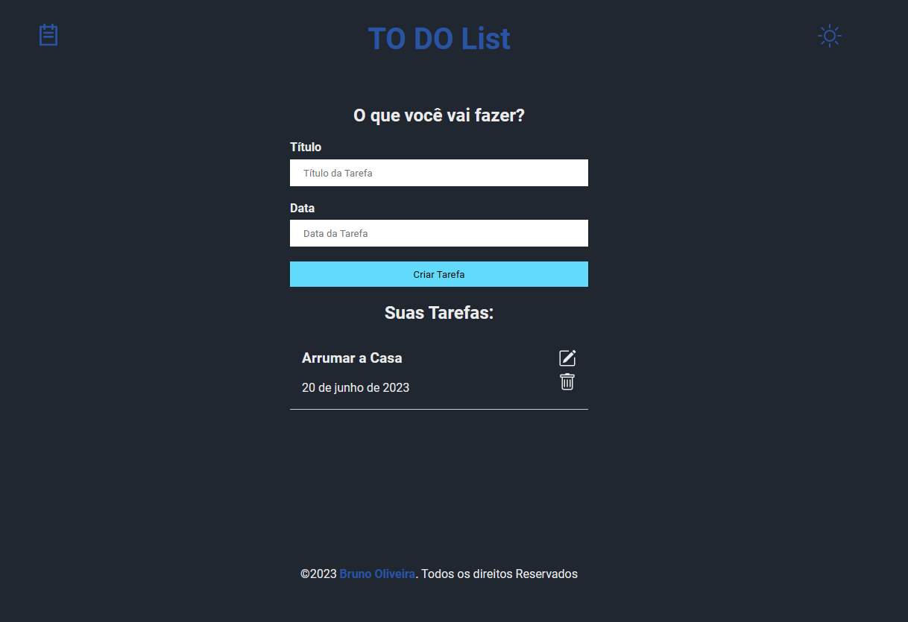

# 🏆 ToDo com Typescript

 

## 📎 Sumario
- 📌 Resumo do Projeto
- ⭐ Features
- 📂 Temas abordados
- ✔️ Tecnologias Utilizadas
- 💻 Demonstração
- 🙋🏻‍♂️ Autor

 

## 📌 Resumo do Projeto
Este Projeto consiste na criação de um app de ToDo construido com react e typescript, onde o usuário podera efetuar o cadastro da sua tarefa, inserindo nome e data, podendo editar e excluir as tarefas de forma individual. O projeto também oferecer melhorias na experiência do usuário, oferecendo a possibilidade de alternar entre tema claro e escuro e oferecendo uma interface amigável com icones intuitivos.

 

## ⭐ Features
- Opção para inserir o nome da tarefa;
- Opção para inserir a data da tarefa;
- Opção para editar a tarefa;
- Opção para excluir a tarefa;
- Opção para alterar o tema da aplicação (claro e escuro);
- Layout simples e elegante;

 

## 📂 Temas abordados
- HTML semântico;
- Estilização com CSS modules;
- Utilização de React;
- Utilização de Typescript;
- Utilização de hooks do react;
- Criação de componentes reutilizáveis;
- utilização de bibliotecas react como react-icons e Datepicker;

 

## ✔️ Tecnologias Utilizadas

 

## 💻 Demonstração
Para visualizar uma prévia do projeto <a href="https://todo-react-ts-bruno.netlify.app/" target="_blank"><b>clique aqui</b></a>

 

## 🙋🏻‍♂️ Autor
| [ Bruno Oliveira](https://github.com/BrunoOliveira16) |
| :---: |